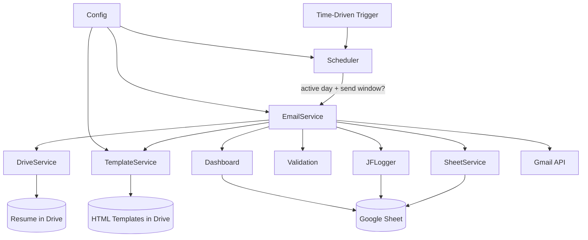
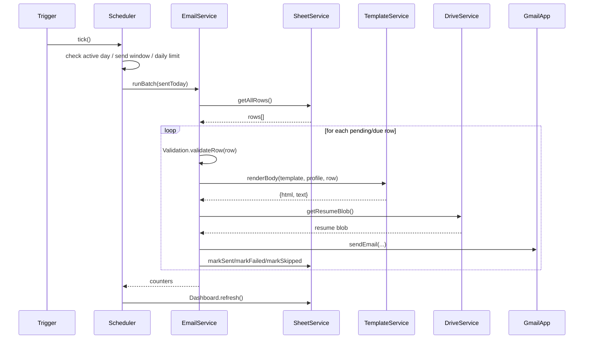

# JobFlow

**A fully automated Job Application Management and Email Automation Platform, powered entirely by Google Workspace (Google Apps Script, Gmail, Sheets, Drive).**


Your computer never needs to stay on. Everything runs on Google's servers via time-driven triggers.

> ⚠️ **Use responsibly.** JobFlow sends emails from *your own* Gmail account to contacts *you* choose to add to the sheet. Respect recipients' time: keep volumes reasonable, personalize genuinely, honor unsubscribe/"no thanks" requests by removing the contact, and follow Google's [Gmail sending limits and policies](https://support.google.com/mail/answer/22839) and any applicable anti-spam laws (e.g. CAN-SPAM) in your jurisdiction.

---

## Table of Contents

- [Project Overview](#project-overview)
- [Features](#features)
- [Architecture](#architecture)
- [Folder Structure](#folder-structure)
- [Installation](#installation)
- [Configuration](#configuration)
- [Scheduling](#scheduling)
- [Troubleshooting](#troubleshooting)
- [Future Roadmap](#future-roadmap)
- [Screenshots](#screenshots)
- [Contributing](#contributing)
- [License](#license)

---

## Project Overview

JobFlow turns a Google Sheet of recruiter/company contacts into an automated, personalized outreach pipeline:

1. You maintain a Google Sheet with rows of companies/recruiters you want to reach.
2. JobFlow picks pending rows, renders a personalized HTML email from a template, attaches your resume from Drive, and sends it via Gmail.
3. It tracks status, prevents duplicate sends, automatically follows up after N days, and reports everything on a Dashboard sheet.
4. A time-driven trigger runs the whole pipeline on a schedule you define — no local machine required.

## Features

- **Email automation** — scheduling, batching, resume attachment, HTML + plain-text fallback, daily limits, retries, structured logging.
- **Duplicate prevention** — never emails the same contact twice unless follow-up mode applies.
- **Template engine** — unlimited `{{placeholder}}`-driven HTML templates (`angular`, `frontend`, `meanstack`, `generic`, `followup` included).
- **Subject rotation** — avoids repeating identical subject lines to the same contact.
- **Config-driven** — zero personal data in source code; everything lives in `profile.json`, `settings.json`, `subjects.json`.
- **Scheduler** — weekday/weekend control, multiple send windows per day, configurable batch size.
- **Follow-up engine** — automatic, opt-in, once-per-contact by default.
- **Dashboard** — live counts of Sent / Pending / Failed / Skipped / Follow-ups.
- **Structured logger** — INFO/WARN/ERROR/SUCCESS levels, exportable to CSV.
- **Dry-run mode** — test the entire pipeline without sending a single real email.
- **Clean architecture** — SOLID, layered (Service / Repository / Utility / Validation / Logging / Scheduler / Template Engine).

## Architecture



### Send sequence



## Folder Structure

```
JobFlow/
├── apps-script/          Google Apps Script source (.gs)
│   ├── Main.gs            Entry points / custom menu
│   ├── Config.gs          Configuration layer
│   ├── EmailService.gs    Core send orchestration
│   ├── TemplateService.gs Template engine + subject rotation
│   ├── SheetService.gs    Google Sheet repository
│   ├── Scheduler.gs       Send-window / daily-limit logic
│   ├── Logger.gs          Structured logger
│   ├── Validation.gs      Email/row validation
│   ├── Utils.gs           Shared helpers
│   ├── DriveService.gs    Resume retrieval
│   ├── TriggerService.gs  Trigger install/uninstall
│   └── Dashboard.gs       Dashboard sheet builder
├── templates/             HTML email templates
├── config/                profile.json / settings.json / subjects.json (blank)
├── sample/                Example sheet + example profile
├── docs/                  Full documentation set
├── .github/                Issue/PR templates
├── .gitignore
├── LICENSE
└── README.md
```

## Installation

See **[docs/INSTALL.md](docs/INSTALL.md)** for the full step-by-step guide. Short version:

1. Create a new Google Sheet (this becomes your Applications tracker).
2. Extensions → Apps Script, and paste in each file from `apps-script/`.
3. Create a Drive folder for config, upload `config/profile.json`, `settings.json`, `subjects.json`, and fill them in with your details.
4. Create a Drive folder for templates, upload everything in `templates/`.
5. In Script Properties, set `CONFIG_FOLDER_ID` and `TEMPLATES_FOLDER_ID`.
6. Reload the Sheet, use the **JobFlow** menu → **Run Dry Run Test**, then **Install Daily Automation**.

## Configuration

See **[docs/CONFIGURATION.md](docs/CONFIGURATION.md)** for every field in `profile.json`, `settings.json`, and `subjects.json`.

## Scheduling

See **[docs/SETUP.md](docs/SETUP.md)** for how `sendWindows`, `activeDays`, `batchSize`, and `dailySendLimit` interact.

## Troubleshooting

See **[docs/FAQ.md](docs/FAQ.md)**.

## Future Roadmap

The architecture is deliberately pluggable so new source integrations can be added without touching the core send pipeline:

- [ ] LinkedIn Jobs integration (import leads into the sheet)
- [ ] Naukri integration
- [ ] Indeed integration
- [ ] Monster integration
- [ ] Dice integration
- [ ] Glassdoor integration
- [ ] Reply detection (Gmail thread scanning) to auto-update the "Replies" metric
- [ ] Web-based configuration UI (Apps Script HTML Service)

Each future source is expected to implement a simple "produce rows matching the Applications sheet schema" contract — no changes to `EmailService`, `TemplateService`, or `Scheduler` should be required.

## Screenshots

_Add screenshots of your Applications sheet, Dashboard, and Logs here._

- `docs/screenshots/applications-sheet.png` (placeholder)
- `docs/screenshots/dashboard.png` (placeholder)
- `docs/screenshots/logs.png` (placeholder)

## Contributing

Contributions are welcome — see **[docs/CONTRIBUTING.md](docs/CONTRIBUTING.md)**.

## License

MIT — see [LICENSE](LICENSE).
